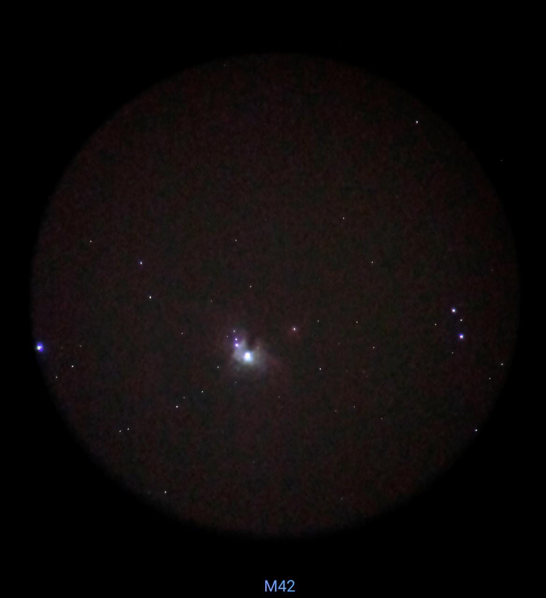
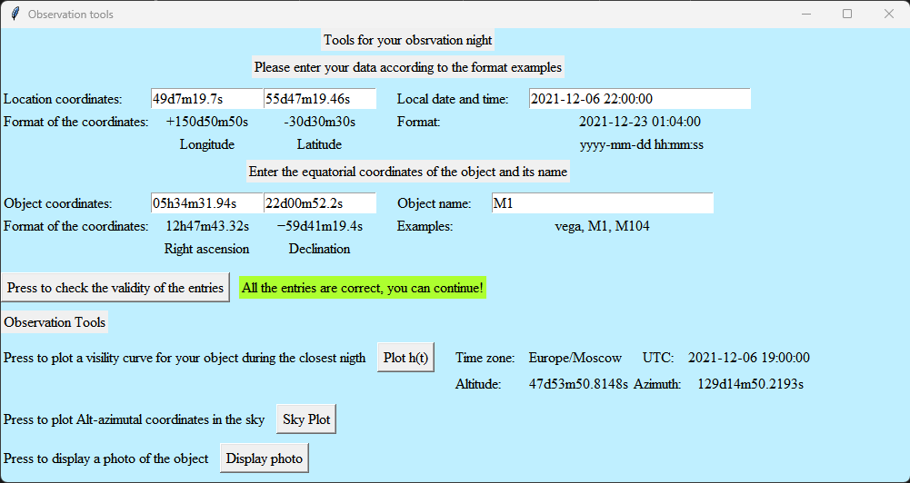

# Astronomical Tools: Visibility Curves and Polar Graphs

  
  
Photo of Messier M45 by Bryan Garay

## Description 
This project consists of a graphical interface made in Python with Tkinter to provide the user with astronomical tools for observing the sky. The tools that can be generated in the interface are: 
- Visibility Curves 
- Polar Graph. 
- Additionally an image of the object can be displayed.

## Libraries used
Much of the project was done thanks to libraries that facilitate the work with astronomy tools such as: 
- Astropy: https://docs.astropy.org/en/stable/.
- Astroplan: https://astroplan.readthedocs.io/en/latest/api.html#module-astroplan.

Also other libraries were used for data management and graphs and visualizations such as:
- Numpy
- Matplotlib

## Interface

The interface looks like this :

There are 6 data entry fields with examples of how data should be entered:
- Observer's location (Longitude and Latitude).
- Coordinates of the object (Right Ascension and Declination).
- Date and local time of the observer. 
- Name of the object. 

The available buttons are:
- Button to verify the data.
- Button to display the visibility curve graph.
- Button to display the object's movement in alt-azimuthal coordinates of the object in a polar plot.
- Button to display a picture of the object.

### Visibility Curves
The first tool displayed to the user is the visibility curve.

A two-dimensional graph with 3 variables can be seen: 
- Altitude: In degrees from 0 to 90. 
- Time in local time: The graph shows 12 hours before and 12 hours after local midnight of the date entered.
- Azimuth: In degrees from 0 to 360, measured from North. This can be seen as a gradient of color. 
- The height of the Sun during the time period with a yellowish curve. 
- The height of the Moon during the time period with a dotted gray curve. 
- The twilights by means of vertical stripes and a gradient of colors being white the day and the darkest black the astronomical night, passing through the twilights: Civil, Nautical and Astronomical.  

### SkyPlot in Polar Graph

In this polar plot we can see the movement of the astronomical object during the observation period 12 hours before and after the astronomical midnight of the date entered. In polar coordinates the angle would be the Azimuth measured from north (0 to 360 degrees) of the object and the distance would be the Altitude (0 to 90 degrees).

### Photo of the Object 

This option allows you to obtain a photo from the repository of NASA Goddard's SkyView service via astroquery.skyview.SkyView, using plot_finder_image from the AstroPlan library. The photo is in negative, and is with absolute equatorial coordinates: DEC and AR. 
Important notice: Some images like stars sometimes do not load. It is usually faster with Messier objects. 

## How to install and run the project?
Download or clone the repository, open it in a Python development environment such as PyCharm or Spyder (in those environments it has been developed and tested) and run the program.
In the repository is the file "Example of data imput.txt" where you have example data that you can enter, but you can enter any other coordinates of another object and location. You can get the picture of the object directly by entering only the name of the object in the format specified in the interface. 
In the case of PyCharm the plots open in a separate window and in Spyder inside Plots in the editor. 

## Contact of the developer:
bryangarayacademico@gmail.com
